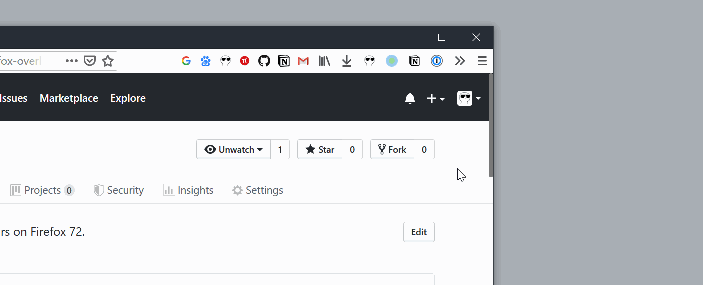

<h1>Firefox Overlay Scrollbars</h1>

🦊 <em>Firefox 自定义浮动滚动条 - 支持 Firefox 72+</em>

<h5> 🎲 来自功能更全面的 Firefox 用户脚本大合集 <a href="https://github.com/Aris-t2/CustomJSforFx">Aris-t2/CustomJSforFx</a>.<h5>

## Demo

## 安装

First, close all instances of Firefox, and **delete Firefox's old script/startup cache** at `about:profiles » Local Directory » Open Folder`

Next, **download the entire repo** with either Git or `Download ZIP`. Uncompress the downloaded zip file.

Then, first find the folder `firefox` inside the downloaded repo directory, **copy the `defaults` folder and the file `config.js` to Firefox's installation directory**, i.e., where `firefox.exe` lives.

Finally:

- Find Firefox's profile folder at `about:support » Profile Folder » Open Folder`, **create a folder called `chrome` inside**

- Then, find the folder `profile` inside the downloaded repo directory, **copy the `userChrome` folder and the file `userChrome.js` to the folder `chrome` that we just created**

Restart Firefox and you should be able to see the custom scrollbar take effect.

## 个性化

We can tweak the file inside our newly created `chrome/userChrome` folder called `custom_scrollbars.uc.js`. See the file's comments for more information.

---

🦊 **Firefox Overlay Scrollbars** ©Spencer Woo. Released under the [MIT License](LICENSE).

Authored and maintained by Spencer Woo.

[@Portfolio](https://spencerwoo.com/) · [@Blog](https://blog.spencerwoo.com/) · [@GitHub](https://github.com/spencerwooo)
