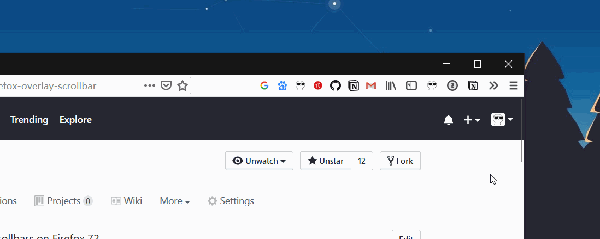

<div align="center">


<h1>Firefox Overlay Scrollbars</h1>

🦊 <em>A working prototype of custom styleable overlay scrollbars on Firefox 72+.</em>


[](./LICENSE)
</div>

<h6> 🎲 Derived from the all-in-one feature-complete Firefox user script repo <a href="https://github.com/Aris-t2/CustomJSforFx">Aris-t2/CustomJSforFx</a>, and the Windows 10 style scrollbar repo <a href="https://github.com/endeavoursc/firefox-overlay-scrollbars-win10">endeavoursc/firefox-overlay-scrollbars-win10</a>.<h6>

## Demo

<h6>There're 2 styles of scrollbar styles available, both are tested and workable on Firefox v72+.</h6>

|               Style                |                             Preview                             |
| :--------------------------------: | :-------------------------------------------------------------: |
|     Windows 10 style scrollbar     |     |
| Custom (rounded corners) scrollbar |  |

## Installation

**WARNING:** You'll need to set `about:config » toolkit.legacyUserProfileCustomizations.stylesheets` to `true` for the following procedures.

To begin with, close all instances of Firefox, and **delete Firefox's old script/startup cache** at `about:profiles » Local Directory » Open Folder`


Next, **download the entire repo** with either Git or `Download ZIP`. Uncompress the downloaded zip file.

Then, find the folder `firefox` inside the downloaded repo directory, **copy the `defaults` folder and the file `config.js` to Firefox's installation directory**, i.e., where `firefox.exe` lives.


Finally:

- Find Firefox's profile folder at `about:support » Profile Folder » Open Folder`, **create a folder called `chrome` inside**


- Then, find the folder `profile` inside the downloaded repo directory, **copy the `userChrome` folder and the file `userChrome.js` to the folder `chrome` that we just created**


Change the `userChrome.js` file, in order to import 2 styles of floating scrollbars that I have included:

- Windows 10 style scrollbar:

```javascript
userChrome.import("/userChrome/custom_scrollbars.uc.js", "UChrm");
```

- Custom (rounded corners) scrollbar:

```javascript
userChrome.import("/userChrome/win10_scrollbars.uc.js", "UChrm");
```

<h6>🔺 <strong>WARNING:</strong> Don't import both userChrome.js scripts, or Firefox will be confused.</h6>

Restart Firefox and you should be able to see the Windows 10 pre-built style or your custom style scrollbar take effect.

## Customization

<h6>🔺 <strong>NOTICE:</strong> Most of tweaks are only available for the <code>custom_scrollbars.uc.js</code> version.</h6>

We can tweak the file inside our newly created `chrome/userChrome` folder called `custom_scrollbars.uc.js`. The following features can be customized:

- hide scrollbars
- hide scrollbar buttons
- **floating scrollbars (on top of web content)**
- custom scrollbar size
- custom scrollbar opacity
- custom scrollbar background color / background image for color gradient
- custom scrollbar corner background color / background image for color gradient
- **custom scrollbar thumb color / background image**
- custom scrollbar hovered-thumb color / background image for color gradient
- custom scrollbar thumb roundness / border-radius
- custom scrollbar thumb border width
- custom scrollbar thumb border color
- custom scrollbar button color / background image for color gradient
- custom scrollbar hovered-button color / background image for color gradient
- custom scrollbar button roundness / border-radius / arrow

See the file's comments for more information.

**You'll need to delete Firefox's old script/startup cache at `about:profiles » Local Directory » Open Folder` every time you change the script under `chrome/userChrome` folder.**

---

🦊 **Firefox Overlay Scrollbars** ©Spencer Woo. Released under the [MIT License](LICENSE).

Authored and maintained by Spencer Woo.

[@Portfolio](https://spencerwoo.com/) · [@Blog](https://blog.spencerwoo.com/) · [@GitHub](https://github.com/spencerwooo)
